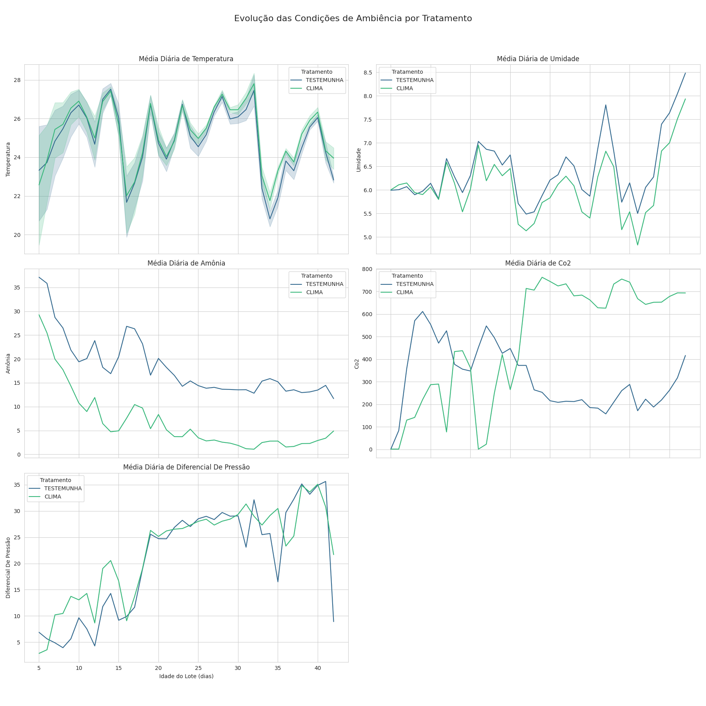

# Análise de Dados do Teste Clima200 (Jaime Basso)

Este repositório contém as análises de dados referentes ao teste de eficiência do sistema de climatização **CLIMA200 da Vencomatic**, comparado a um sistema de controle testemunha. O objetivo é avaliar o impacto do controle de ambiência no desempenho de lotes de frangos de corte.

## Metodologia e Premissas do Teste

A análise comparativa foi realizada a partir de dados coletados de dois aviários na granja de Jaime Basso:

- **Aviário CLIMA200:** Equipado com o sistema CLIMA200 (identificado como `1283`).
- **Aviário TESTEMUNHA:** Utilizando um sistema de controle convencional (identificado como `1282`).

Os dados foram extraídos da plataforma **eProdutor** e de sensores IoT, abrangendo o período de alojamento de 19/08/2025 a 01/10/2025.

A metodologia consistiu em:
1.  **Coleta e Preparação:** Consolidação dos dados de desempenho dos lotes, leituras de sensores de ambiência (temperatura, umidade, amônia, CO2) e consumo (ração e energia) em um banco de dados SQLite.
2.  **Análise Comparativa de KPIs:** Avaliação de indicadores de desempenho (Mortalidade, Conversão Alimentar, IEP, Peso Médio) entre os dois tratamentos.
3.  **Análise da Ambiência:** Monitoramento da evolução das variáveis de ambiência para avaliar a estabilidade e eficiência do CLIMA200.
4.  **Acompanhamento Diário:** Análise de métricas diárias para identificar tendências e anomalias no desenvolvimento dos lotes.

A premissa central do teste é que um controle de ambiência mais preciso, proporcionado pelo **CLIMA200**, resulta em melhores condições de bem-estar para as aves, refletindo em indicadores zootécnicos superiores e maior eficiência produtiva.

## Visualizações dos Resultados

As análises geraram visualizações que destacam as principais diferenças entre os tratamentos.

### Comparativo de KPIs
O gráfico abaixo ilustra a diferença nos principais indicadores de performance entre o sistema CLIMA200 e o Testemunha.


### Evolução da Ambiência
Este gráfico demonstra a capacidade do CLIMA200 em manter as variáveis de ambiência (como temperatura e umidade) mais estáveis e dentro das faixas ideais.



### Acompanhamento Diário
O monitoramento diário de métricas como mortalidade e consumo de ração revela a consistência do desenvolvimento do lote no ambiente controlado.


## Estrutura do Repositório

```
/home/brunoconter/Code/Git/Clima200JaimeBasso/
├───.gitignore
├───main.py
├───README.md
├───.git/...
├───data/
│   ├───processed/
│   └───raw/
├───database/
│   ├───clima_prod.db
│   └───sql/
├───docs/
│   ├───DATAS DATA ALOJAMENTO.txt
│   └───Relatório de Eficiência: CLIMA200 vs. TESTEMUNHA.md
├───knowledge/
├───notebooks/
├───plots/
│   ├───ambiencia_evolution.png
│   ├───daily_monitoring.png
│   └───kpi_comparison.png
└───src/
    ├───create_db.py
    ├───...
    └───utils/
```

## Como Executar a Análise

1.  **Configurar o Ambiente:**
    ```bash
    python -m venv venv
    source venv/bin/activate
    pip install -r requirements.txt
    ```
2.  **Executar o Pipeline de Dados:**
    ```bash
    python main.py
    ```
    O script `main.py` orquestra a criação do banco de dados, processamento dos dados brutos e geração das análises e visualizações.
